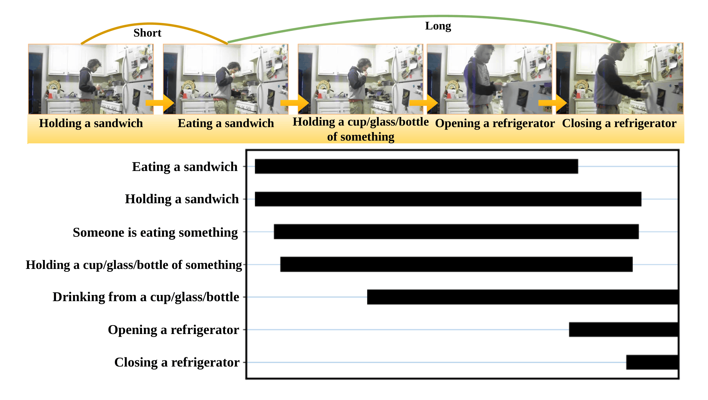
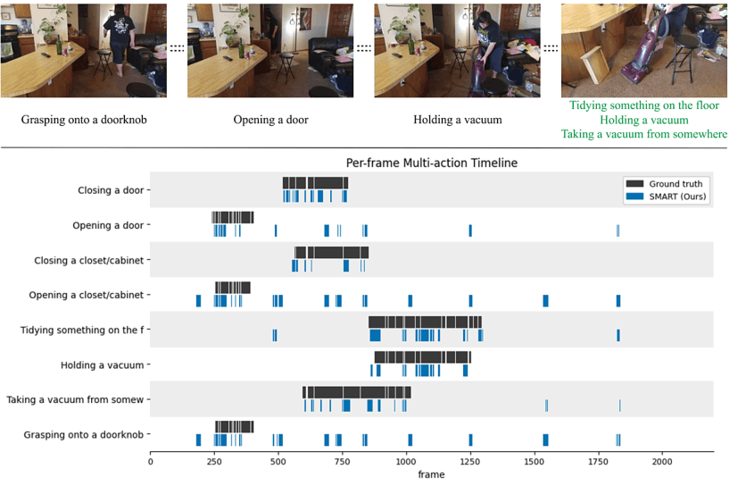
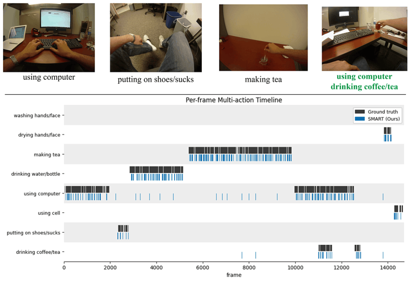

# SMART: Semi-Supervised Egocentric Multi-Action Recognition

[](https://icvgip.in/)
[](https://www.python.org/)
[](https://pytorch.org/)
[](LICENSE)

> **Pawanesh Kumar Vishwakarma, Abhimanyu Sahu**
> Department of Computer Science & Engineering,
> Motilal Nehru National Institute of Technology Allahabad, Prayagraj, India
> **ICVGIP'26** — 17th Indian Conference on Computer Vision, Graphics and Image Processing, Kolkata, India

**SMART** = **S**emi-supervised **M**ulti-**A**ction **R**ecogni**T**ion

---

## Overview

Egocentric and daily-living videos routinely contain several actions at once — a
person *holds a sandwich* while *eating a sandwich*, then *holds a cup* while
*opening* and *closing a refrigerator*. Existing multi-label methods handle this,
but every one of them needs exhaustive frame-level annotation, which does not
scale to new environments.

SMART predicts **all concurrent actions on every frame from only 10% labelled
frames**. Since so few labels cannot train a reliable classifier directly, SMART
instead exploits the intrinsic structure of video: labels are propagated over a
graph connecting visually and temporally related frames.



Existing graph-based propagation methods are built for the single-label case —
they diffuse all classes jointly and decode with `argmax`, which forces one
action per frame and cannot represent concurrency at all. SMART addresses this
with four components:

**1 — Multimodal feature extraction.**
Each frame passes through **DEFT** (*Dynamic Egocentric Feature Transformation*),
which estimates a bounded affine transformation to spatially align the
hand–object interaction region while preserving global scene context. The
localised frame and its optical flow are encoded by a **frozen EfficientNet-B0**
and fused by a **co-attention** module. DEFT and the fusion are fine-tuned on the
seed frames alone, under **Asymmetric Loss**.

**2 — Cumulative Sparse Video Graph (CSVG).**
Fully connected graphs carry many weak, noisy edges; fixed *k*-NN graphs keep the
same number of neighbours regardless of the local feature distribution — a poor
fit for egocentric video, where appearance similarity varies sharply between
windows. CSVG mean-centres features inside each window, converts cosine distance
into Gaussian affinities with a bandwidth `σ = median{d_ij}` estimated *from that
window*, then keeps, per frame, the smallest neighbourhood whose cumulative
normalised affinity exceeds `γ`. Confident frames get compact neighbourhoods,
ambiguous ones get larger. Temporal edges between consecutive frames preserve
continuity.

**3 — Independent per-class label propagation.**
Each action class runs its **own** random walk over the shared transition matrix,
with seed frames clamped to their ground-truth labels after every iteration.
Because the walks never compete, multiple actions accumulate evidence on the same
frame simultaneously. This is the single design choice that makes concurrency
possible: replacing it with conventional joint propagation costs **10.1 mAP on
Charades and 35.7 mAP on ADL**.

**4 — Multi-Action Head with row-centering.**
Propagated scores are contaminated by three factors: the stationary bias of graph
diffusion, unequal seed counts across classes, and — most importantly — a
frame-level activity component shared by all classes, which makes highly active
frames light up every class at once. The head removes them in sequence:
stationary subtraction → per-class standardisation → temporal moving average →
co-occurrence refinement → **row-centering**.


Row-centering is the key contribution. Writing the propagated score as
`S_ic = a_i + b_ic`, where `a_i` is the frame-level activity shared across classes
and `b_ic` the class-specific evidence, subtracting each frame's mean across
classes removes `a_i` **exactly**:

```
S̃_ic  =  S_ic − (1/C) Σ_c' S_ic'  =  b_ic − b̄_i
```

Within-frame ranking is untouched (so top-1 is unchanged), but *across* frames the
score now depends only on `b_ic`. Removing it costs **15.7 mAP on Charades and
8.4 mAP on ADL**.

---

## Results

### Charades — comparison with state of the art

Every competing method is **fully supervised on dense frame-level annotations**.
SMART uses **10% labelled seed frames**.

| Method | Venue | mAP |
|---|---|---|
| TGM | ICML'19 | 20.60 |
| MLAD | CVPR'21 | 18.40 |
| PDAN | WACV'21 | 23.70 |
| Coarse-Fine | CVPR'21 | 25.10 |
| MS-TCT | CVPR'22 | 25.40 |
| PointTAD | NeurIPS'22 | 12.10 |
| PAT | ICCV'23 | 26.50 |
| DualDETR | CVPR'24 | 15.30 |
| MS-Temba | CVPR'26 | 33.60 |
| **SMART (ours)** | — | **37.73** |

SMART matches or exceeds MS-Temba with **75.6% fewer parameters**.

### ADL

| Method | Venue | Top-1 |
|---|---|---|
| DAN-EAR | TIP'19 | 48.35 |
| EAT-MBNet | TCSVT'21 | 81.96 |
| LSTA | TCSVT'24 | 79.31 |
| EgoADL | IMWUT'24 | 70.40 |
| **SMART (ours)** | — | **49.70** |

> These methods perform **fully supervised single-action** recognition, assigning
> one dominant action per clip. SMART performs **semi-supervised frame-level
> multi-action** recognition from 10% labelled frames. The numbers are indicative,
> not directly comparable.

### Headline

| Dataset | mAP | Macro-F1 | Micro-F1 | Top-1 |
|---|---|---|---|---|
| **Charades** | **37.73** | 26.26 | 29.71 | **34.53** |
| **ADL** | **48.17** | 57.45 | 57.12 | **49.70** |

```bash
python evaluate.py --data_dir artifacts/charades --feat_suffix _effnet --window 100 --rw_steps 10 --gamma 0.90
python evaluate.py --data_dir artifacts/adl      --feat_suffix _effnet --window 100 --rw_steps 10 --gamma 0.90
```

---

## Ablations

All reproducible from `tools/ablations.ipynb` or the command line.

### Component ablation

| Variant | Charades mAP | Charades Top-1 | ADL mAP | ADL Top-1 |
|---|---|---|---|---|
| w/o DEFT | 14.87 | 24.05 | 31.17 | 35.25 |
| w/o CDF sparsification | 35.26 | 28.22 | 44.86 | 48.22 |
| w/o temporal edges | 35.77 | 28.15 | 45.70 | 38.50 |
| w/o row-centering | 22.06 | 28.53 | 39.80 | 38.03 |
| **SMART** | **37.73** | **34.53** | **48.17** | **49.70** |

Removing DEFT is the single largest degradation (−22.9 mAP on Charades),
confirming that localising the hand–object region is what makes the graph
meaningful in the first place.

```bash
python evaluate.py --data_dir artifacts/charades --feat_suffix _effnet --window 100 --no_row_center
python evaluate.py --data_dir artifacts/charades --feat_suffix _effnet --window 100 --no_cdf
python evaluate.py --data_dir artifacts/charades --feat_suffix _effnet --window 100 --no_temporal
# w/o DEFT requires re-extraction with a DEFT-free front-end
```

### Independent vs joint propagation

| Strategy | Charades mAP | Charades Top-1 | ADL mAP | ADL Top-1 |
|---|---|---|---|---|
| Joint propagation | 27.59 | 27.40 | 12.50 | 29.45 |
| **Independent per-class** | **37.73** | **34.53** | **48.17** | **49.70** |

The ADL collapse (48.17 → 12.50) is the clearest evidence in the paper: when
classes compete for probability mass, concurrent actions annihilate each other.

```bash
python evaluate.py --data_dir artifacts/adl --feat_suffix _effnet --window 100 --prop_mode joint
```

### Graph sparsification — CDF vs kNN

| Rule | Value | Charades mAP | Charades Top-1 | ADL mAP | ADL Top-1 |
|---|---|---|---|---|---|
| kNN | k = 5 | 33.65 | 22.46 | 46.14 | 46.00 |
| kNN | k = 10 | 31.12 | 20.44 | 45.80 | 45.60 |
| kNN | k = 15 | 30.58 | 22.94 | 45.22 | 44.84 |
| kNN | k = 20 | 30.71 | 20.17 | 44.90 | 44.17 |
| CDF | γ = 0.80 | 36.31 | 34.00 | 47.10 | 47.37 |
| CDF | γ = 0.85 | 36.91 | 34.21 | 47.65 | 48.88 |
| **CDF** | **γ = 0.90** | **37.73** | **34.53** | **48.17** | **49.70** |
| CDF | γ = 0.95 | 36.01 | 34.12 | 47.37 | 48.80 |

CDF beats every kNN setting on both datasets, and stays within 36.01–37.73 mAP
across the whole γ range — the graph construction is robust to this parameter.

```bash
python evaluate.py --data_dir artifacts/charades --feat_suffix _effnet --window 100 --sparsify knn --knn_k 10
python evaluate.py --data_dir artifacts/charades --feat_suffix _effnet --window 100 --gamma 0.85
```

### Backbone and modality

| Modality | Backbone | Charades mAP | Charades Top-1 | ADL mAP | ADL Top-1 |
|---|---|---|---|---|---|
| RGB + Flow | CLIP ViT-B/32 | 34.74 | 27.50 | 46.74 | 49.36 |
| RGB + Flow | ResNet-50 | 36.91 | 34.12 | 48.00 | 50.25 |
| RGB only | EfficientNet-B0 | 37.00 | 26.62 | 46.31 | 48.44 |
| Flow only | EfficientNet-B0 | 29.00 | 19.06 | 45.68 | 46.25 |
| **RGB + Flow** | **EfficientNet-B0** | **37.73** | **34.53** | **48.17** | **49.70** |

RGB dominates flow (37.00 vs 29.00 on Charades) — appearance carries the primary
cue for daily-living actions. CLIP underperforms here despite its general
strength, suggesting its embedding geometry suits graph propagation under sparse
supervision less well than a supervised ImageNet backbone.

Each row needs its own `extract_features.py` run; then it is only a different
`--feat_suffix`:

| Row | `--backbone` | `--modality` | `--feat_suffix` |
|---|---|---|---|
| CLIP | `clip` | `fusion` | `_clip` |
| ResNet-50 | `resnet50` | `fusion` | `_resnet` |
| RGB only | `efficientnet_b0` | `rgbonly` | `_rgbonly` |
| Flow only | `efficientnet_b0` | `flowonly` | `_flowonly` |
| **Full** | `efficientnet_b0` | `fusion` | `_effnet` |

### Loss function

| Loss | Charades mAP | ADL mAP |
|---|---|---|
| Binary Cross-Entropy | 34.32 | 44.14 |
| **Asymmetric Loss** | **37.73** | **48.17** |

```bash
python train.py ... --loss bce      # vs the default --loss asl
```

---

## Statistical Significance

Five independent stratified seed selections, full pipeline re-run each time.

| Metric | Charades SMART | Charades w/o RC | ADL SMART | ADL w/o RC |
|---|---|---|---|---|
| mAP | **37.73 ± 0.98** | 22.06 ± 0.65 | **48.17 ± 0.37** | 39.80 ± 0.02 |
| Macro-F1 | **26.26 ± 1.52** | 16.91 ± 1.95 | **57.45 ± 0.33** | 24.97 ± 0.74 |
| Micro-F1 | **29.71 ± 2.08** | 23.11 ± 2.36 | **57.12 ± 0.12** | 24.50 ± 0.33 |
| Top-1 | **34.53 ± 1.82** | 28.53 ± 1.82 | **49.70 ± 0.26** | 38.03 ± 0.26 |

Paired Wilcoxon signed-rank on row-centering: **p = 0.004** (Charades),
**p = 0.031** (ADL). Paired *t*-test across runs: **p < 10⁻⁵**.

Reproduce with section 8 of [`tools/ablations.ipynb`](tools/ablations.ipynb):

```python
STATS = stats_report(DATA_DIR, UNITS, FEAT_SUFFIX, n_runs=5)
```

---

## Efficiency

Measured on 100-frame windows from Charades (N = 100, C = 39 classes), excluding
the frozen backbone.

| Module | Params (M) | GFLOPs | Learnable |
|---|---|---|---|
| DEFT + EfficientNet-B0 | 0.869 | — | yes |
| Co-attention fusion | 3.278 | — | yes |
| CSVG (graph construction) | — | 0.026 | **no** |
| Per-class random walk | — | 0.004 | **no** |
| Multi-Action Head | — | 0.002 | **no** |
| **Full pipeline** | **4.147** | **0.032** | — |

Peak memory **0.55 GB**. Three of the five stages have **zero learned
parameters** — propagation and decoding are pure matrix arithmetic.

Verify the parameter counts against your build:

```bash
python -c "
import torch
from model import SMARTFrontEnd
m = SMARTFrontEnd('efficientnet_b0', num_classes=39, modality='fusion', device='cpu')
with torch.no_grad(): m.deft.theta(torch.randn(1,3,224,224))   # build DEFT's lazy fc
deft = sum(p.numel() for p in m.deft.parameters())
fus  = sum(p.numel() for p in m.fusion.parameters())
print(f'DEFT              : {deft/1e6:.3f}M   (paper 0.869M)')
print(f'Co-attn fusion    : {fus/1e6:.3f}M   (paper 3.278M)')
print(f'Total trainable   : {(deft+fus)/1e6:.3f}M   (paper 4.147M)')
"
```

Expected — these reproduce Table 9 of the paper exactly:

```
DEFT              : 0.869M   (paper 0.869M)
Co-attn fusion    : 3.278M   (paper 3.278M)
Total trainable   : 4.147M   (paper 4.147M)
```

### Complexity

| Stage | Complexity |
|---|---|
| EfficientNet-B0 feature extraction | O(N·D·K²) |
| DEFT + co-attention fusion | O(N·D) |
| CSVG pairwise affinities | O(N²·D) |
| CSVG cumulative neighbourhood selection | O(N² log N) |
| Independent per-class propagation | O(t·\|E\|·C) |
| Multi-Action Head | O(N·C) |

With `D`, `K`, `t`, `C` fixed in practice, SMART is **O(N²)** in the window size
and memory is **O(N²)** for the sparse graph and transition matrix. Because
windows are fixed-size and non-overlapping, cost scales **linearly with video
length**.

---

## Repository Structure

```
SMART/
├── dataset.py              # Step 1: class map, multi-hot targets, windows, seeds
├── train.py                # Step 2: fine-tune DEFT + fusion on the 10% seeds
├── extract_features.py     # Step 3: extract per-frame fused features
├── evaluate.py             # Step 4: CSVG -> per-class random walk -> head -> mAP
├── model.py                # DEFT, CoAttnFusion, ASL, backbone factory
├── requirements.txt
├── LICENSE
├── tools/
│   ├── imports.py          # common imports, seeding, sanity-check helper
│   ├── graph.py            # CSVG: PDF affinities, CDF/kNN pruning, random walks
│   ├── head.py             # Multi-Action Head: calibration -> row-centering -> decode
│   ├── metrics.py          # mAP, macro/micro F1, Top-1, LRAP
│   ├── ablations.ipynb     # every table above + sweeps + significance testing
│   └── visualize_graph.ipynb  # Figure 5: per-class propagation over the graph
├── ADL/Labels/             # per-participant annotation CSVs
├── Charades/Labels/        # the Charades annotation CSV
├── Splits/                 # seed-mask protocol (README.txt)
└── images/                 # figures
```

Generated at runtime and **not tracked** (see `.gitignore`): `artifacts/`
(targets, seeds, features) and `checkpoints/` (weights). These ship through
GitHub Releases instead — a single feature file is several MB.

### Paper section → code map

| Paper | Code |
|---|---|
| Eq. 1 — DEFT | `model.py :: DEFT` |
| Eq. 2 — co-attention fusion | `model.py :: CoAttnFusion` |
| Eq. 3 — Asymmetric Loss | `model.py :: ASL` |
| Eq. 4–6 — mean-centering, cosine distance, adaptive affinity | `tools/graph.py :: normalize_features, pdf_weights` |
| Eq. 7–8 — CDF sparsification | `tools/graph.py :: cdf_sparsify` |
| Eq. 9 — transition matrix | `tools/graph.py :: transition_matrix` |
| Eq. 10 — independent per-class walk | `tools/graph.py :: propagate` |
| Eq. 11 — stationary subtraction | `tools/head.py :: h71_stationary` |
| Eq. 12 — standardisation | `tools/head.py :: h72_calibrate` |
| Eq. 13 — temporal moving average | `tools/head.py :: h73_smooth` |
| Eq. 14 — co-occurrence refinement | `tools/head.py :: h74_cooccur` |
| Eq. 15 — row-centering | `tools/head.py :: head_transform` (`row_center=True`) |
| Eq. 16 — class-specific thresholds | `tools/head.py :: fit_thresholds, h75_threshold` |
| Algorithm 1 | `evaluate.py :: score_unit, run_unit` |
| Joint-propagation baseline (Table 5) | `tools/graph.py :: propagate_joint` |

---

## Installation

- Python **3.10+**
- CUDA-capable GPU recommended
- 16 GB+ RAM

```bash
git clone https://github.com/pawanesh-mnnit/SMART.git
cd SMART

python -m venv smart_env
source smart_env/bin/activate          # Windows: smart_env\Scripts\activate

# PyTorch matching your CUDA version (check with nvidia-smi)
pip install torch torchvision --index-url https://download.pytorch.org/whl/cu121

pip install -r requirements.txt
```

Verify:

```bash
python -c "
import torch, torchvision, numpy, pandas, scipy, matplotlib, networkx, plotly
print('torch:', torch.__version__, '| CUDA:', torch.cuda.is_available())
print('All OK')
"
```

---

## Quick Sanity Check (No Dataset Required)

Runs CSVG → per-class random walk → Multi-Action Head on synthetic data in a
couple of seconds.

```bash
python -c "
import numpy as np
from tools.graph import build_window_graph, propagate
from tools.head import cooccurrence, head_transform, fit_thresholds, h75_threshold
from tools.metrics import evaluate

rng = np.random.default_rng(0)
n, C, D = 120, 5, 64

# ground truth with deliberate overlaps: classes 0 and 1 co-occur on frames 40-70
Y = np.zeros((n, C), np.float32)
Y[0:70, 0] = 1; Y[40:100, 1] = 1; Y[10:30, 2] = 1; Y[75:110, 3] = 1; Y[100:120, 4] = 1
proto = rng.normal(size=(C, D))
F = np.stack([proto[np.where(Y[i] > 0)[0]].mean(0) + 0.25 * rng.normal(size=D)
              if Y[i].sum() else rng.normal(size=D) for i in range(n)])

seeds = np.zeros(n, bool)
for c in range(C):
    seeds[rng.choice(np.where(Y[:, c] > 0)[0], 3, replace=False)] = True

P, sigma = build_window_graph(F)
Co   = cooccurrence(Y[seeds])
raw  = propagate(P, Y, seeds, steps=10)
S    = head_transform(raw, P, Co)
taus = fit_thresholds(S[seeds], Y[seeds])
ev   = ~seeds
pred = h75_threshold(S[ev], taus)
m    = evaluate(pred, S[ev], Y[ev])

print('transition matrix  :', P.shape, '| column-stochastic:', np.allclose(P.sum(0), 1))
print('sigma (data-driven):', round(sigma, 3))
print('raw walk scores    :', raw.shape)
print('head scores        :', S.shape)
print('decoded label sets :', pred.shape)
print('seeds              :', int(seeds.sum()), '/', n, 'frames')
print('mAP                :', round(m['mAP'], 4))
print('multi-action frames predicted:', int((pred.sum(1) >= 2).sum()), '/', len(pred))
print('Pipeline OK')
"
```

Expected output:

```
transition matrix  : (120, 120) | column-stochastic: True
sigma (data-driven): 1.098
raw walk scores    : (120, 5)
head scores        : (120, 5)
decoded label sets : (105, 5)
seeds              : 15 / 120 frames
mAP                : 0.6743
multi-action frames predicted: 80 / 105
Pipeline OK
```

This is a wiring check, not a quality claim — the synthetic clusters are far
cleaner than real video. What it confirms is that `P` is column-stochastic, the
shapes survive the whole chain, and the head emits genuine multi-label sets
rather than collapsing to one class per frame.

---

## Datasets

### Charades

Sigurdsson & Gupta, ECCV 2016 — <https://prior.allenai.org/projects/charades>

```
/path/to/Charades/
├── RGB/00HFP/rgb/frame_000001.jpg         6-digit, 1-indexed
├── Flow/00HFP/flow/frame_000001.jpg
└── Label/Charades_Annotation.csv          copy into Charades/Labels/
```

### ADL

Pirsiavash & Ramanan, CVPR 2012 —
<https://www.csee.umbc.edu/~hpirsiav/papers/ADLdataset/>

```
/path/to/ADL/
├── Frames/P_09/Original_P_09/frame_00000.jpg    5-digit, 0-indexed
├── OpticalFlow/P_09/viz/frame_00000.jpg
└── Label/P_09_labeled.csv                       copy into ADL/Labels/
```

Annotation schemas: [`ADL/Labels/README.md`](ADL/Labels/README.md),
[`Charades/Labels/README.md`](Charades/Labels/README.md).

---

## Pretrained Models

**[Download from GitHub Releases v1.0.0](https://github.com/pawanesh-mnnit/SMART/releases/tag/v1.0.0)**

| File | Type | Dataset | Configuration |
|---|---|---|---|
| `charades_deft_fusion_effnet.pt` | checkpoint | Charades | **main result** |
| `adl_deft_fusion_effnet.pt` | checkpoint | ADL | **main result** |
| `*_deft_fusion_resnet.pt` | checkpoint | both | ResNet-50 ablation |
| `*_deft_fusion_clip.pt` | checkpoint | both | CLIP ablation |
| `*_deft_rgbonly.pt` / `*_deft_flowonly.pt` | checkpoint | both | modality ablation |
| `charades_artifacts.zip` | features + targets | Charades | all suffixes |
| `adl_artifacts.zip` | features + targets | ADL | all suffixes |

```bash
mkdir -p checkpoints artifacts
unzip charades_artifacts.zip -d artifacts/charades
python evaluate.py --data_dir artifacts/charades --feat_suffix _effnet --window 100
```

---

## Usage

### Step 1 — Targets, windows and seeds

```bash
# Charades
python dataset.py --dataset charades \
    --rgb_root /path/to/Charades/RGB \
    --anno_csv Charades/Labels/Charades_Annotation.csv \
    --out_dir  artifacts/charades \
    --window 100 --seed_frac 0.10 --min_per_class 2 --seed 42

# ADL
python dataset.py --dataset adl \
    --rgb_root  /path/to/ADL/Frames \
    --anno_root ADL/Labels \
    --out_dir   artifacts/adl \
    --window 100 --seed_frac 0.10 --min_per_class 2 --seed 42
```

Run this over **all** units at once — the class map must be shared.

### Step 2 — Fine-tune DEFT + fusion on the seeds

```bash
python train.py --dataset charades \
    --rgb_root  /path/to/Charades/RGB \
    --flow_root /path/to/Charades/Flow \
    --data_dir  artifacts/charades \
    --backbone efficientnet_b0 --epochs 3 --batch 32 \
    --save_path checkpoints/charades_deft_fusion_effnet.pt
```

**3 epochs, as in the paper.** There are only a few hundred seed frames; training
until the seed loss bottoms out memorises them and the propagated scores get
*worse*. The backbone stays frozen throughout.

### Step 3 — Extract features

```bash
python extract_features.py \
    --checkpoint checkpoints/charades_deft_fusion_effnet.pt \
    --rgb_root   /path/to/Charades/RGB \
    --flow_root  /path/to/Charades/Flow \
    --data_dir   artifacts/charades
```

Writes `artifacts/charades/<video>_feats_effnet.npz`.

### Step 4 — Propagate and evaluate

```bash
python evaluate.py \
    --data_dir artifacts/charades \
    --feat_suffix _effnet \
    --window 100 --rw_steps 10 --gamma 0.90
```

Extras:

```bash
--protocol pooled      # global thresholds and co-occurrence over pooled seeds
--diagnostics          # zero-seed windows, sigma spread, per-class AP
--save_labels          # per-frame predicted label SETS as CSV
--timeline 00HFP       # Figure 4-style GT-vs-SMART timeline into images/
--save_json results.json
```

---

## Hyperparameters

Exactly as reported in Section 4.2 of the paper.

| Parameter | Value | Flag |
|---|---|---|
| Input resolution | 224 × 224 | `--img_size` |
| Backbone | EfficientNet-B0 (**frozen**) | `--backbone` |
| Fine-tuned modules | DEFT + co-attention fusion | — |
| Epochs | 3 | `--epochs` |
| Optimizer | Adam | — |
| Learning rate | 1e-3 | `--lr` |
| Weight decay | 1e-3 | `--weight_decay` |
| DEFT branch learning rate | 5e-3 | `--deft_lr` |
| Loss | Asymmetric Loss | `--loss` |
| Batch size | 32 | `--batch` |
| **Window size N** | **100** (non-overlapping) | `--window` |
| **CDF threshold γ** | **0.90** | `--gamma` |
| **Propagation steps t** | **10** | `--rw_steps` |
| Kernel bandwidth σ | median pairwise distance per window | `--sigma_mode` |
| Feature normalisation | per-window mean-centering | `--feat_norm` |
| Seed fraction | 10% of labelled frames | `--seed_frac` |
| Min seeds per class | 2 | `--min_per_class` |
| Random seed | 42 | `--seed` |
| Threshold criterion | F-β, **β = 0.5** | `--fbeta` |
| Temporal smoothing radius | 5 | `--w_smooth` |
| Co-occurrence weight λ | 0.3 | `--lam` |
| Row-centering | **on** | `--no_row_center` disables |
| Max labels per frame | 3 | `--max_k` |

DEFT gets a 5× higher learning rate than the fusion because its gradient is the
weakest in the chain — it arrives through a frozen encoder.

> **Note on the embedding dimension.** Section 3.1 of the paper states *d* = 512,
> but the parameter counts in Table 9 correspond to the native EfficientNet-B0
> dimension *d* = 1280 (the fusion's `Linear(2·1280 → 1280)` is exactly 3.278M
> parameters). This implementation uses the backbone's native dimension and
> therefore reproduces Table 9 exactly — see the Efficiency section above.

---

## Evaluation Protocol

Full detail in [`Splits/README.txt`](Splits/README.txt).

- Seeds are 10% of a unit's **labelled** frames, drawn so every class present
  contributes at least 2, with the remainder sampled at random.
- Seed frames are **excluded from evaluation** — scoring them would inflate every
  metric.
- `per_unit` (default): each unit runs independently; metrics averaged with equal
  weight per unit.
- `pooled`: per-unit graphs, but global co-occurrence, global thresholds, and
  metrics pooled over every non-seed frame.
- Metrics: **mAP** (ranking quality of the propagated scores) and **Top-1**
  (dominant action correctness), plus macro/micro F1.

---

## Qualitative Results





SMART recovers overlapping actions over time from sparse supervision. As a person
grasps a doorknob, opens a door and operates a vacuum, the actions *holding a
vacuum*, *taking a vacuum from somewhere* and *tidying something on the floor* are
correctly localised over the same intervals; paired *opening*/*closing* actions of
doors and cabinets are accurately detected. Predictions fragment slightly over
long intervals because propagation is window-wise, but onset and duration are
preserved.

**Failure mode.** On Charades video `VID_00X3U`, the object-centric *taking a
blanket from somewhere* is recognised reliably (0.80 AP), while appearance-driven
actions such as *someone is smiling* (0.41 AP) and *someone is running somewhere*
(0.47 AP) do much worse. These lack distinctive object or motion cues, so visually
similar frames cluster tightly in the graph and propagation becomes unreliable.

Generate your own:

```bash
python evaluate.py --data_dir artifacts/adl --feat_suffix _effnet \
    --window 100 --timeline P_11 --fig_dir images
```

The three-panel propagation visualisation (Figure 5 of the paper — initial frame
graph, seed initialisation, propagated labels) is produced by
[`tools/visualize_graph.ipynb`](tools/visualize_graph.ipynb).

---

## Tested Environment

| Component | Specification |
|---|---|
| CPU | Intel Xeon W-2295 (18 cores, 3.00 GHz) |
| RAM | 128 GB DDR4 |
| GPU | NVIDIA RTX A4000 |
| Python | 3.10.x |
| torch | 2.5.1+cu121 |
| torchvision | 0.20.1+cu121 |
| numpy / pandas / scipy | 1.24+ / 2.0+ / 1.10+ |
| networkx / plotly | 3.1+ / 5.15+ |
| CUDA | 12.1 |

---

## Related Work by the Authors

- **DEFT-DPT** — the feature transformation module reused here.
  Vishwakarma, Singh & Sahu, *IEEE TCSVT*, 2026.
- **EgoHAnG** — graph-enhanced horizon-aware egocentric action anticipation.
  Vishwakarma, Chowdhury & Sahu, *ICPR*, 2026.
  [github.com/pawanesh-mnnit/EgoHANG](https://github.com/pawanesh-mnnit/EgoHANG)

Future work extends the multi-action framework here with action anticipation.

---

## Citation

```bibtex
@inproceedings{vishwakarma2026smart,
  title     = {SMART: Semi-Supervised Egocentric Multi-Action Recognition},
  author    = {Vishwakarma, Pawanesh Kumar and Sahu, Abhimanyu},
  booktitle = {Proceedings of the 17th Indian Conference on Computer Vision,
               Graphics and Image Processing (ICVGIP'26)},
  year      = {2026},
  address   = {Kolkata, India},
  publisher = {ACM},
  doi       = {10.1145/nnnnnnn.nnnnnnn}
}
```

---

## Contact

- Pawanesh Kumar Vishwakarma — `pawanesh.2023rcs04@mnnit.ac.in`
- Abhimanyu Sahu (corresponding author) — `abhimanyus@mnnit.ac.in`

Department of Computer Science & Engineering,
Motilal Nehru National Institute of Technology Allahabad, Prayagraj, India

---

## License

Released under the [CC BY-NC 4.0 License](LICENSE). Free for academic and research
use; commercial use requires permission. The datasets and pretrained backbones
carry their own licenses.
